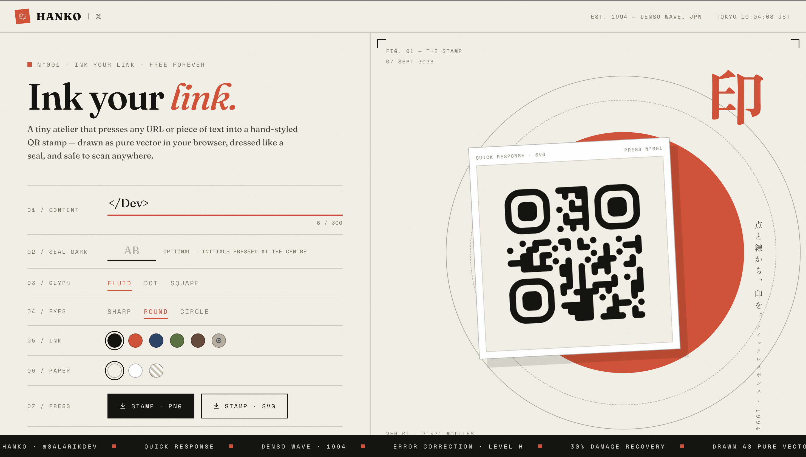

# HANKO — Ink your link

A tiny atelier that presses any link into a hand-styled QR stamp.
Type a URL → watch it get pressed into paper, module by module.
Export as SVG or 1600px PNG. No servers, no accounts — everything runs in your browser.

**[Live site →](https://l55slr.github.io/Hanko/)**

- Fluid / dot / square module styles, three finder-eye shapes
- Press your initials into the centre seal (EC level H keeps it scannable)
- Custom ink & paper colours, incl. transparent
- Pure client-side SVG rendering

QR engine: [qrcode-generator](https://github.com/kazuhikoarase/qrcode-generator) (MIT)